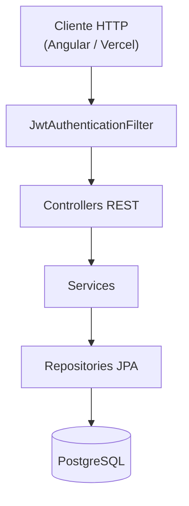

# Visão geral da arquitetura

O back-end segue a arquitetura em camadas padrão do Spring Boot, organizada no pacote base:

```
com.github.gabrielbachega1.gerenciador_planos_aula
```

## Estrutura de pacotes

```
src/main/java/.../gerenciador_planos_aula/
├── GerenciadorPlanosAulaApplication.java   # Bootstrap
├── config/
│   ├── SecurityConfig.java                 # Spring Security + CORS
│   └── JwtAuthenticationFilter.java        # Filtro JWT por requisição
├── controller/                             # Camada REST (API)
├── service/                                # Regras de negócio
├── repository/                             # Acesso a dados (Spring Data JPA)
├── model/                                  # Entidades JPA
└── dto/                                    # Objetos de transferência
```

## Diagrama de camadas



## Fluxo de uma requisição autenticada

1. O cliente envia `Authorization: Bearer <token>`.
2. `JwtAuthenticationFilter` intercepta a requisição (exceto login, cadastro e OPTIONS).
3. O token é validado pelo `JwtService`; os *claims* são armazenados no `HttpServletRequest`.
4. O `SecurityContext` recebe a autenticação com o UUID do usuário como *subject*.
5. O controller acessa os *claims* ou delega ao service.
6. O service executa a lógica de negócio e persiste via repository.

## Recursos do domínio

| Recurso | Controller | Service | Entidade |
|---|---|---|---|
| Usuários | `UsuarioController` | `UsuarioService` | `Usuario` |
| Planos de aula | `PlanoAulaController` | `PlanoAulaService` | `PlanoAula` |
| Habilidades BNCC | `HabilidadeBNCCController` | `HabilidadeBNCCService` | `HabilidadeBNCC` |
| Vínculo plano-habilidade | `PlanoHabilidadeBNCCController` | `PlanoHabilidadeBNCCService` | `PlanoHabilidadeBNCC` |

## Dependências Maven principais

```xml
spring-boot-starter-web
spring-boot-starter-data-jpa
spring-boot-starter-security
spring-boot-starter-validation
postgresql
jjwt-api / jjwt-impl / jjwt-jackson (0.12.5)
lombok
```

## Convenções adotadas

- **IDs:** UUID gerados automaticamente (`GenerationType.UUID`).
- **Senhas:** hash BCrypt via `BCryptPasswordEncoder`.
- **DTOs:** Java Records com validação Jakarta (`@NotBlank`, `@Email`, etc.).
- **Erros:** `ResponseStatusException` com códigos HTTP semânticos.
- **Datas:** `LocalDate` para data da aula; `LocalDateTime` para auditoria (`created_at`, `updated_at`).
