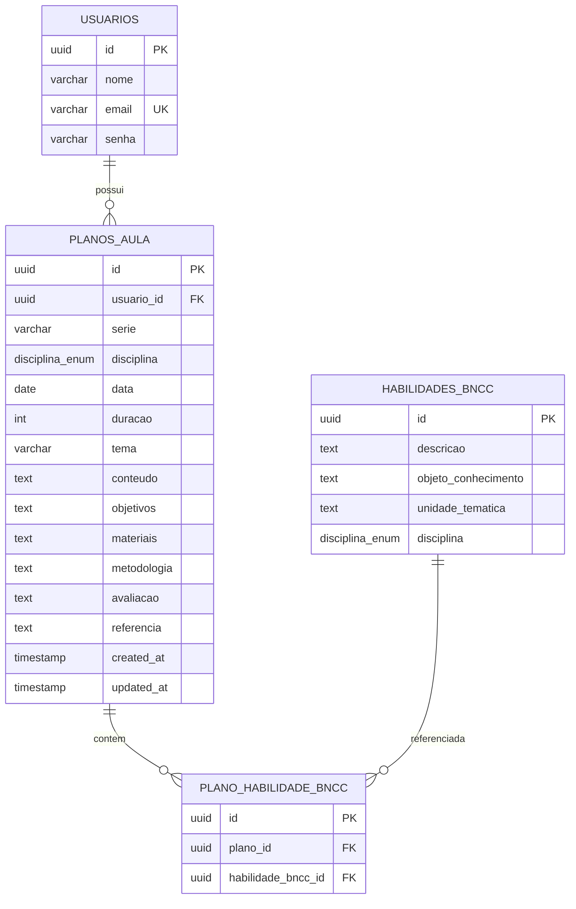

# Modelo de dados

O banco PostgreSQL utiliza o tipo enum nativo `disciplina_enum` e chaves primárias UUID.

## Diagrama ER



## Tabela `usuarios`

| Coluna | Tipo | Restrições |
|---|---|---|
| `id` | UUID | PK, gerado automaticamente |
| `nome` | VARCHAR(150) | NOT NULL |
| `email` | VARCHAR(150) | NOT NULL, UNIQUE |
| `senha` | VARCHAR(255) | NOT NULL (hash BCrypt) |

**Entidade JPA:** `Usuario` — campo `senha` anotado com `@JsonIgnore`.

## Tabela `planos_aula`

| Coluna | Tipo | Restrições |
|---|---|---|
| `id` | UUID | PK |
| `usuario_id` | UUID | FK → `usuarios(id)` |
| `serie` | VARCHAR(50) | NOT NULL |
| `disciplina` | `disciplina_enum` | NOT NULL |
| `data` | DATE | NOT NULL |
| `duracao` | INTEGER | NOT NULL (minutos) |
| `tema` | VARCHAR(255) | opcional |
| `conteudo` | TEXT | opcional |
| `objetivos` | TEXT | opcional |
| `materiais` | TEXT | opcional |
| `metodologia` | TEXT | opcional |
| `avaliacao` | TEXT | opcional |
| `referencia` | TEXT | opcional |
| `created_at` | TIMESTAMP | default `CURRENT_TIMESTAMP` |
| `updated_at` | TIMESTAMP | default `CURRENT_TIMESTAMP` |

**Entidade JPA:** `PlanoAula`

- `@ManyToOne` com `Usuario` (LAZY, `@JsonIgnore` no usuário).
- `@ManyToMany` com `HabilidadeBNCC` via tabela `plano_habilidade_bncc`.
- `@PrePersist` / `@PreUpdate` preenchem `createdAt` e `updatedAt`.

## Tabela `habilidades_bncc`

| Coluna | Tipo | Restrições |
|---|---|---|
| `id` | UUID | PK |
| `descricao` | TEXT | NOT NULL |
| `objeto_conhecimento` | TEXT | opcional |
| `unidade_tematica` | TEXT | opcional |
| `disciplina` | `disciplina_enum` | NOT NULL |

**Entidade JPA:** `HabilidadeBNCC`

## Tabela `plano_habilidade_bncc`

Tabela de junção com `ON DELETE CASCADE` nas FKs.

| Coluna | Tipo | Restrições |
|---|---|---|
| `id` | UUID | PK |
| `plano_id` | UUID | FK → `planos_aula(id)` |
| `habilidade_bncc_id` | UUID | FK → `habilidades_bncc(id)` |

> **Nota:** Existe também o mapeamento `@ManyToMany` em `PlanoAula.habilidades` que utiliza a mesma tabela. A entidade `PlanoHabilidadeBNCC` expõe um CRUD dedicado para vínculos individuais.

## Enum `DisciplinaEnum`

Valores do Ensino Fundamental e Médio:

```
ARTE
CIENCIAS
COMPUTACAO
EDUCACAO_FISICA
ENSINO_RELIGIOSO
GEOGRAFIA
HISTORIA
LINGUA_INGLESA
LINGUA_PORTUGUESA
MATEMATICA
CIENCIAS_DA_NATUREZA_E_SUAS_TECNOLOGIAS
CIENCIAS_HUMANAS_E_SOCIAIS_APLICADAS
COMPUTACAO_ENSINO_MEDIO
LINGUAGENS_E_SUAS_TECNOLOGIAS
MATEMATICA_E_SUAS_TECNOLOGIAS
```

No PostgreSQL, o enum é mapeado com `@JdbcTypeCode(SqlTypes.NAMED_ENUM)` em `PlanoAula`.
