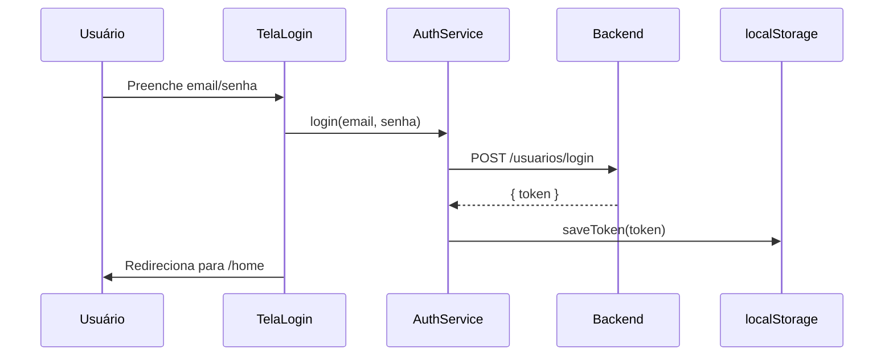
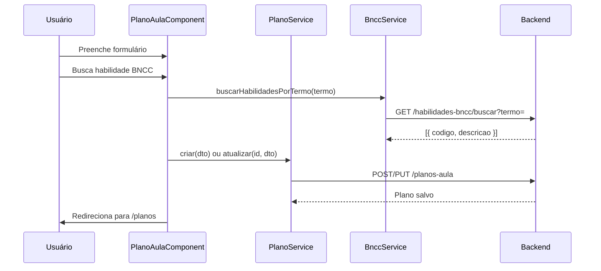

# Visão Geral da Arquitetura

## Padrão arquitetural

A aplicação segue o padrão **SPA (Single Page Application)** com arquitetura em camadas simplificada:

```
┌─────────────────────────────────────────┐
│           Componentes (UI)              │
│  Landing, Login, Home, PlanoAula, etc.  │
└─────────────────┬───────────────────────┘
                  │
┌─────────────────▼───────────────────────┐
│         Serviços (Camada de dados)      │
│   AuthService │ PlanoService │ BnccService│
└─────────────────┬───────────────────────┘
                  │ HTTP (REST)
┌─────────────────▼───────────────────────┐
│              Backend API                │
│         (Spring Boot / Railway)         │
└─────────────────────────────────────────┘
```

## Características principais

### Componentes standalone

Todos os componentes utilizam o modelo **standalone** do Angular (sem `NgModule`). Cada componente declara explicitamente seus imports:

```typescript
@Component({
  selector: 'app-home',
  standalone: true,
  imports: [CommonModule, RouterModule, TopbarComponent],
  ...
})
```

### Roteamento declarativo

As rotas são definidas em `src/app/app.routes.ts` com lazy loading implícito via import estático de componentes.

### Guard funcional de autenticação

Rotas protegidas utilizam `AuthGuard` (`CanActivateFn`), que verifica a presença do token no `localStorage`.

### Comunicação HTTP

- `HttpClient` injetado nos serviços
- Autenticação via header `Authorization: Bearer <token>`
- Sem interceptors globais configurados

### Formulários reativos

Telas com entrada de dados utilizam `ReactiveFormsModule` com validações síncronas (`Validators`).

### Programação reativa

Operações assíncronas usam **RxJS** (`Observable`, `subscribe`, operadores como `debounceTime`, `switchMap`).

## Fluxo de autenticação



## Fluxo de plano de aula



## Decisões de design

| Decisão | Justificativa |
|---|---|
| Exportação PDF/Excel no cliente | Reduz carga no backend; permite download imediato |
| Token no localStorage | Simplicidade; adequado para MVP |
| Componentes standalone | Padrão moderno do Angular 19; menos boilerplate |
| Busca BNCC com debounce (400ms) | Evita requisições excessivas durante digitação |
